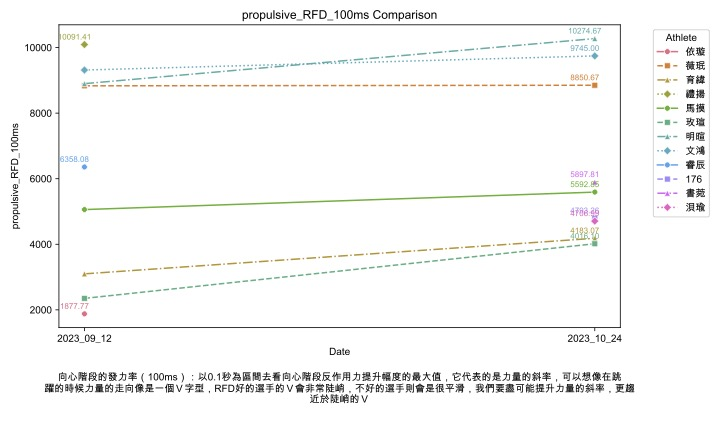
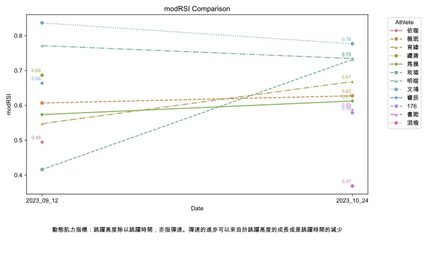
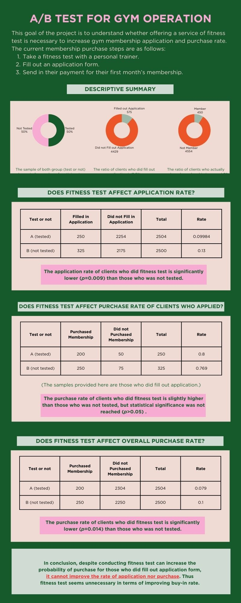

# [Project 1: CMJ Data Processing and Analysis]

## [CMJ Analysis Python Tool](https://github.com/shengsandc/CMJ-analysis/blob/5241994d198cac9bfa7b9d90a3d169296753b9c5/CMJ.py)
## [Visualization of the CMJ Performance](https://github.com/shengsandc/CMJ-analysis/blob/500ed6ee0720c13eb4c9b02df1defc3f97fde44c/CMJ_visualisation.py)
This is a python tool I developed to process and analyze ground reaction force data collected from a force plate. This tool essentially analyze CMJ GRF data to understand how athletes jump by interpreting various jumping variable (including strategy-wised, performance-wised).

* Data source: self-collected (sampling rate:1000Hz; sampling duration: 10s; n_force_plates=2; n_trial_per_athlete=3)
* Modules used: pandas, os, numpy, time, glob, matplotlib, seaborn, and textwrap

 

# [Project 2: Biodiversity Analysis in National Parks]
## [python code for biodiversity analysis](https://github.com/shengsandc/Biodiversity/blob/f5d176b6c49dc2e3025796095e5fc8392d4695e5/biodiversity_.ipynb)
This project was aimed to analyze conservation status of species in National Parks. I managed to explore the distribution of species in conservation among categories and National Parks. The project also involved Chi-square test to test out the significance.

* Data source: Codecademy
* Modules used: pandas, os, numpy, sqlite3, matplotlib, seaborn, scipy, itertools and IPython
* Result: we discovered the conservation status of species categories and National Parks with significant difference, and identify species that potentially require conservation in the future. The details are provided in the Jupyter Notebook file.

# [Project 3: A/B test for Gym Operation]
## [python code for A/B test](https://github.com/shengsandc/Gym-AB-Test/blob/1081b2a1c0f288bdd65d289af6f15e9412423538/Gym%20AB%20Test.ipynb)
The goal of the project is to understand whether offering a service of fitness test can affect gym membership application and purchase decision.

* Data source: Codecademy
* Modules used: pandas, matplotlib, scipy, and os

# [Project 4: US Census Data Cleaning and Analysis]
## [python code for census data cleaning and analysis] (https://github.com/shengsandc/Census-Data-Cleaning/blob/42f54ac48e25835b9dfa3f5368df830c027463a8/Cleaning%20Census%20Data.ipynb)
This project aimed to analyze US census data. Main issue of the dataset is that most data required cleaning before further analysis.

* Data source: Codecademy
* Modules used: pandas, numpy, glob, matplotlib, seaborn, and scipy.stats
* Result: we discovered a positive relationship between Asian american percentage and average income. Furthermore, we found that most states have more female than male.

